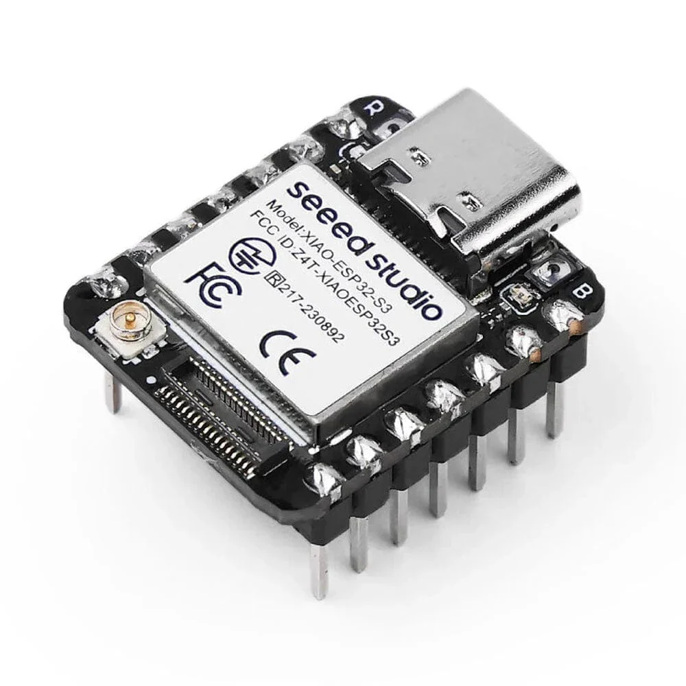

# Seeed-Studio-XIAO-ESP32S3
A simple, beginner-friendly embedded hardware project using the Seeed Studio XIAO ESP32S3 and a Common Cathode RGB LED to cycle through vibrant color spectrums using Pulse Width Modulation (PWM).

---

## 🔬 Hardware Overview

### Seeed Studio XIAO ESP32S3
The Seeed Studio XIAO ESP32S3 is a compact, high-performance development board based on the **ESP32-S3** dual-core Xtensa LX7 microcontroller (operating up to 240MHz). Despite its tiny form factor (21x17.5mm), it packs powerful features perfect for IoT, AI, and wearable applications:
* **Memory:** 512KB SRAM & 8MB Flash storage.
* **Wireless:** Integrated Wi-Fi 802.11 b/g/n and Bluetooth 5 (LE).
* **Peripherals:** 14-bit High-resolution ADC, 12 capacitive touch sensors, USB-OTG, and versatile interfaces including GPIO, UART, I2C, SPI, and PWM.

---

## 🛠️ Components Needed For Xiao Cathode Rgb Driver

| Component | Quantity | Description |
| :--- | :---: | :--- |
| **Seeed Studio XIAO ESP32S3** | 1 | Microcontroller (with pre-soldered pins) |
| **RGB LED** | 1 | Common Cathode (4 pins) |
| **200Ω Resistors** | 3 | Current limiting resistors for protection |
| **Breadboard** | 1 | Standard half-size or full-size |
| **Jumper Wires** | 2 | Male-to-Male hookup wires |
| **USB-C Cable** | 1 | For power and programming |
